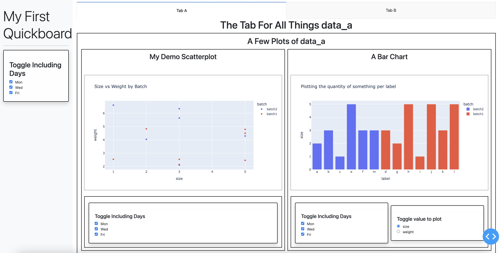
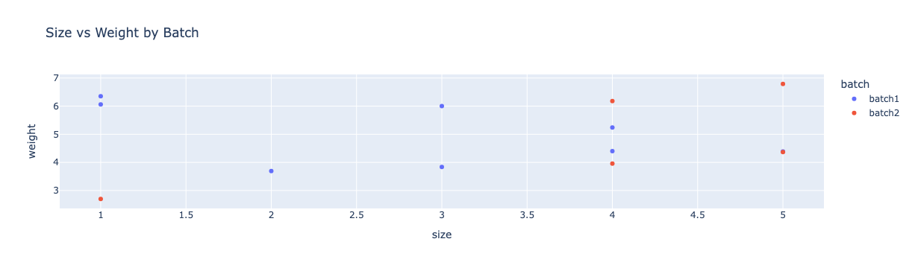
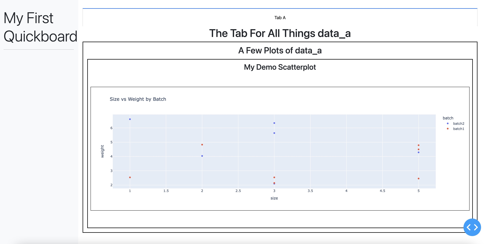
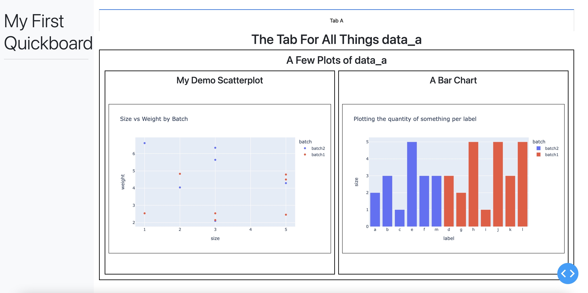
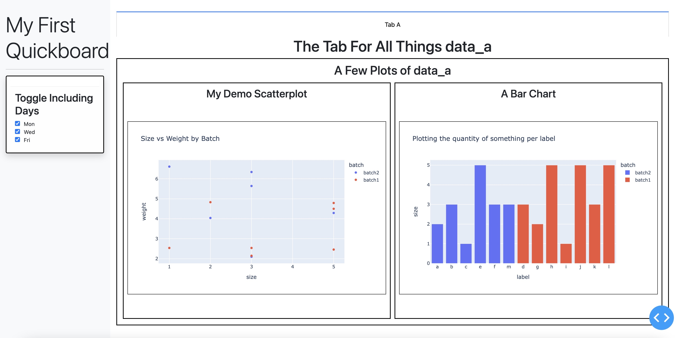
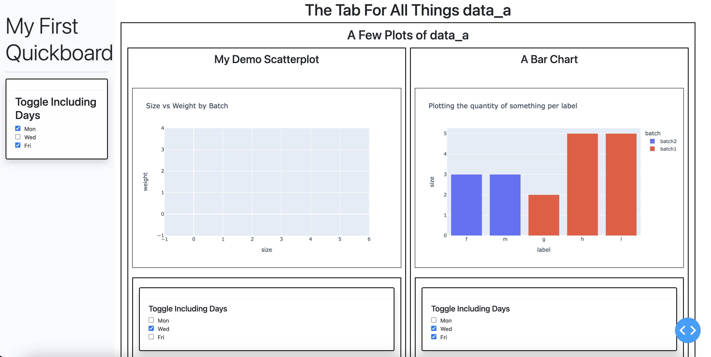
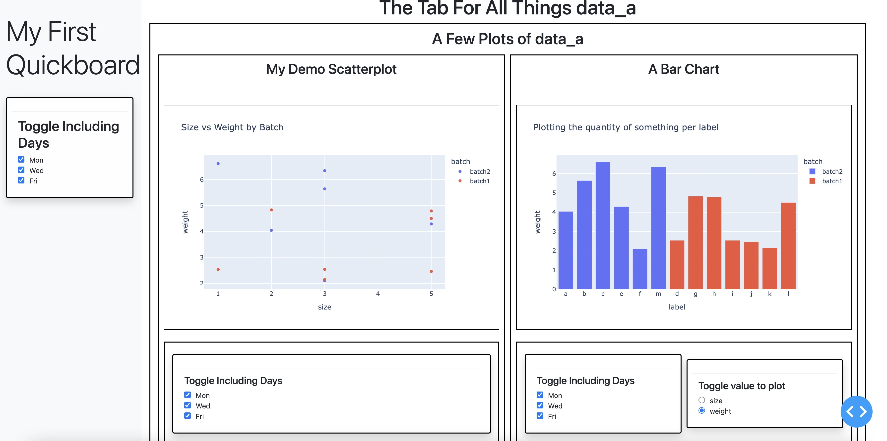

## Guided Example

This is a beginner's guide to creating a larger scale app than the examples shown in the 
[Component Gallery](component_gallery.md). To demonstrate how to use the Quickboard components together, let's work 
through a simple example. We're going to recreate the following board.



In this guide, we'll run code using a Jupyter notebook. All code blocks should be thought of as cells in the notebook,
though it should also work fine to gather the main pieces into a `.py` file and run it.

### Table of Contents
1. [The Data](#the-data)
2. [Tab A: First Plot](#tab-a-first-plot)
3. [Creating the Overall Layout](#creating-the-overall-layout)
4. [Tab A: Second Plot](#tab-a-second-plot)
5. [Plugins](#plugins)
6. [Tab B: A New World](#tab-b-a-new-world)
7. [Final Hierarchy and Code](#final-hierarchy-and-code)

### The Data

Let's generate some data to use for our board. Here are some code blocks to create two files.

First we have `data_a.tsv`, generated with:
```
import numpy as np
import pandas as pd

data_a = pd.DataFrame({'label': ['a', 'b', 'c', 'd', 'e', 'f', 'g', 'h', 'i', 'j', 'k', 'l', 'm']})
data_a['size'] = np.random.choice(range(1,6), len(data_a))
data_a['weight'] = 5 * np.random.random(len(data_a)) + 2
data_a['weight'] = data_a['weight'].apply(lambda x: round(x, 2))
data_a['day'] = np.random.choice(['Mon', 'Wed', 'Fri'], len(data_a))
data_a['batch'] = np.random.choice(['batch1', 'batch2'], len(data_a))
```

Then we have `data_b.tsv`, generated with:
```
data_b = pd.DataFrame({'label': ['a', 'b', 'c', 'd', 'e', 'f', 'g', 'h', 'i', 'j', 'k', 'l', 'm', 'n', 'o', 'p', 'q']})
data_b['size'] = np.random.choice(range(4,10), len(data_b))
data_b['measurement'] = 7 * np.random.random(len(data_b)) + 3
data_b['day'] = np.random.choice(['Mon', 'Wed', 'Fri'], len(data_b))
data_b['batch'] = np.random.choice(['batch1', 'batch2'], len(data_b))
```

Here is what they look like. For `data_a.tsv`:

|    | label   |   size |   weight | day   | batch   |
|---:|:--------|-------:|---------:|:------|:--------|
|  0 | a       |      2 |     4.04 | Mon   | batch2  |
|  1 | b       |      3 |     5.64 | Wed   | batch2  |
|  2 | c       |      1 |     6.61 | Wed   | batch2  |
|  3 | d       |      3 |     2.54 | Wed   | batch1  |
|  4 | e       |      5 |     4.29 | Wed   | batch2  |
|  5 | f       |      3 |     2.1  | Fri   | batch2  |
|  6 | g       |      2 |     4.83 | Fri   | batch1  |
|  7 | h       |      5 |     4.79 | Fri   | batch1  |
|  8 | i       |      1 |     2.54 | Wed   | batch1  |
|  9 | j       |      5 |     2.46 | Wed   | batch1  |
| 10 | k       |      3 |     2.15 | Mon   | batch1  |
| 11 | l       |      5 |     4.5  | Fri   | batch1  |
| 12 | m       |      3 |     6.34 | Fri   | batch2  |

And for `data_b.tsv`:

|    | label   |   size |   measurement | day   | batch   |
|---:|:--------|-------:|--------------:|:------|:--------|
|  0 | a       |      9 |       6.22343 | Wed   | batch1  |
|  1 | b       |      5 |       7.545   | Mon   | batch2  |
|  2 | c       |      6 |       5.98645 | Fri   | batch1  |
|  3 | d       |      7 |       8.30217 | Mon   | batch1  |
|  4 | e       |      7 |       4.88089 | Wed   | batch1  |
|  5 | f       |      5 |       9.09543 | Fri   | batch1  |
|  6 | g       |      8 |       5.43039 | Wed   | batch1  |
|  7 | h       |      9 |       7.51989 | Mon   | batch1  |
|  8 | i       |      4 |       7.95468 | Mon   | batch2  |
|  9 | j       |      6 |       6.99687 | Mon   | batch1  |
| 10 | k       |      7 |       7.94129 | Wed   | batch1  |
| 11 | l       |      8 |       7.08559 | Fri   | batch2  |
| 12 | m       |      9 |       6.02301 | Fri   | batch2  |
| 13 | n       |      9 |       8.57015 | Wed   | batch2  |
| 14 | o       |      8 |       4.56614 | Mon   | batch2  |
| 15 | p       |      6 |       7.72713 | Mon   | batch2  |
| 16 | q       |      8 |       9.6404  | Wed   | batch2  |

Let's visualize some plots using these data sets.

### Tab A: First Plot

We're going to focus on creating Tab A first. But before getting to that, let's explore the data a little and figure out
a plot we'd like to put in first. We can try using Plotly first with the data. For example, let's try the following.

```
import plotly.express as px

px.scatter(data_a, x='size', y='weight', color='batch', title='Size vs Weight by Batch')
```

This should give the following plot:



It's a bit wide by default, but that's OK. Let's put this plot into our board. To start, we need to make a `PlotPanel` 
object to hold the plot. 

```
import quickboard.base as qbb

SizeWeightPlot = qbb.PlotPanel(
    header='My Demo Scatterplot',    # A string rendered in larger text above the plot
    plotter=px.scatter,    # A function used to produce a Plotly plot
    plot_inputs={    # A dict of inputs for the plotter; compare with our example plot above
        'x': 'size',
        'y': 'weight',
        'color': 'batch',
        'title': 'Size vs Weight by Batch'
    },
    data_source=data_a    # DataFrame generated/loaded in memory above; can also use file path to csv/tsv
)
```

The code should run just fine, but nothing appears yet! That's because we didn't call the `start_app` function. 
There are examples of viewing just a `PlotPanel` in the [Component Gallery](component_gallery.md), so let's keep going 
and create a full dashboard that can scale to handle new plots easily.

### Creating the Overall Layout

To set up the infrastructure of the board, we work from the inside out. The `PlotPanel` is at the "deepest" layer of the
board, so we need to think about what the next object to hold it should be. For this example, we'll use a `ContentGrid`,
which is useful for formatting multiple items into a grid. This isn't very useful now with just one plot, but will be 
when we want to add new components.

To do that, let's create the object and put our `SizeWeightPlot` inside:
```
TabA_CG = qbb.ContentGrid(
    header='A Few Plots of data_a',
    content_list=[    # Here we put a list of Panel's or more ContentGrid's to display inside
        SizeWeightPlot
    ],
    col_wrap=2
)
```

The next layer up is the tab itself. We can use the `BaseTab` class to create this:

```
TabA = qbb.BaseTab(
    tab_label='Tab A',    # This is the label that appears in the tab button itself
    tab_header='The Tab For All Things data_a',    # This appears in large text at the top of the tab inside
    content_list=[     # This is a list of other components like ContentGrid's or PlotPanel's to include in the tab
        TabA_CG
    ],
    sidebar_header="My First Quickboard"    # This is the text to appear ontop of the Sidebar, and can change per tab
)
```

We're at the last step of setting up our board infrastructure. Let's make a Quickboard to hold it all together!

```
board = qbb.Quickboard(
    tab_list=[    # List of BaseTab's to include in the board
        TabA
    ]
)
```

We've now assembled all the ingredients to make a Quickboard. To review, here is the hierarchy of the objects we
created:

```
├─ Quickboard
|    ├─ BaseTab
|    |    ├─ ContentGrid
|    |    |    ├─ PlotPanel
```

So how do we see it? We just need to run a certain function, with our Quickboard as input.

```
from quickboard.app import start_app

start_app(board, mode="external", port=8050)    # Note: The default port is 8050, but change to run multiple boards
```

Running this in Jupyter should output a link to `127.0.0.1:8050`. If you click the link, or go to that url in a browser
after running in a terminal (with the `mode` input removed in that case), you can finally see the board!



There it is! But it's still a lot of overhead for just one plot. Let's try adding some more stuff.

### Tab A: Second Plot

Now that we invested so much in setting up the framework for the board, adding a second plot is a breeze. Let's make 
another `PlotPanel`. Add this to the code block where you put the other `PlotPanel`.

```
LabelBarPlot = qbb.PlotPanel(
    header='A Bar Chart',
    plotter=px.bar,
    plot_inputs={
        'x': 'label',
        'y': 'size',
        'color': 'batch',
        'title': 'Plotting the quantity of something per label'
    },
    data_source=data_a
)
```

We can drop this right into the `ContentGrid` we made before. Let's modify it like so:

```
TabA_CG = qbb.ContentGrid(
    header='A Few Plots of data_a',
    content_list=[
        SizeWeightPlot,
        LabelBarPlot    # NEW LINE HERE
    ],
    col_wrap=2
)
```

Rerun this code block and the ones following it, and run the `start_app` function again. Our second plot has been added!
(Tip: If you get `Duplicate callback outputs` errors when trying to modify and rerun, try restarting the notebook 
kernel.)



This example should show some of the power of building up a board with modular components like this. An investment in 
the higher layer objects makes it very easy to drop in new features. The new hierarchy looks like this:

```
├─ Quickboard
|    ├─ BaseTab
|    |    ├─ ContentGrid
|    |    |    ├─ PlotPanel (1)
|    |    |    ├─ PlotPanel (2)
```

Although things are starting to come together visually, there still isn't much interactivity beyond what Plotly provides
natively. Let's change that... by adding in some more components.

### Plugins

Plugins are the magic that make Quickboard worth it. We can make some aesthetically pleasing layouts using what we know
already, but the true power comes from being able to manipulate the plotted data on the spot using various control
elements. 

Plugins meant for controlling elements on the page come in two flavors: `Sidebar` controls and `DynamicPanel` controls
(`PlotPanel`s and `DataPanel`s, which are similar to `PlotPanel`s but for displaying data tables). Generally, `Sidebar`
controls are meant to perform actions at the *tab*-level, whereas others act directly on their parent containing object.
We'll do an example of a `Sidebar` control first.

#### Sidebar Plugins

Because `Sidebar` controls work on the tab-level, we'll modify our code for the tab to put in a plugin. We'll use the
`DataFilterChecklist` plugin to demonstrate the idea.

```
import quickboard.plugins as plg     # Note the new import!

TabA = qbb.BaseTab(
    tab_label='Tab A',
    tab_header='The Tab For All Things data_a',
    content_list=[
        TabA_CG
    ],
    sidebar_header="My First Quickboard",
    sidebar_plugins=[   # List of plugin objects to populate the sidebar while on this tab
        plg.DataFilterChecklist(
            header='Toggle Including Days',
            data_col='day',     # Name of the column we want to filter based on checked items
            data_values=['Mon', 'Wed', 'Fri']    # List of column values to put in the checklist
        )
    ]
)
```

Now when you rerun the code, you'll see our plugin on the left.



Now our board is interactive beyond the usual Plotly capabilities. Try clicking the checklist buttons and watch the
plots update in real time! Can you see what's happening?

As the name implies, the `DataFilterChecklist` plugin filters the data so that the `day` column is contained in the list
of selected values. Because we made it a sidebar plugin, this affects all of the plots on the page.

#### Plot Plugins

But what if we wanted to do a similar style of filtering just on one specific plot? We can use a similar syntax but
instead as a plot control plugin. Let's implement the same filtering power over the `day` column but just for the bar
graph.

```
LabelBarPlot = qbb.PlotPanel(
    header='A Bar Chart',
    plotter=px.bar,
    plot_inputs={
        'x': 'label',
        'y': 'size',
        'color': 'batch',
        'title': 'Plotting the quantity of something per label'
    },
    data_source=data_a,
    plugins=[     # Notice we use just "plugins" now
        plg.DataFilterChecklist(
            header='Toggle Including Days',
            data_col='day',     
            data_values=['Mon', 'Wed', 'Fri']    # List of column values to put in the checklist
        )
    ]
    
)
```

You can rerun the code and see what appears. There's now a similar checklist below the plot, and has similar power over
filtering the data, but just for that plot. If you restrict on both the sidebar and the plot plugins, you'll get the
intersection of both control effects. You can add a similar control to the other plot to make it look a little nicer.



Our hierarchy now looks like:
```
├─ Quickboard
|    ├─ Sidebar
|    ├─ BaseTab
|    |    ├─ DataFilterChecklist (Sidebar Plugin)
|    |    ├─ ContentGrid
|    |    |    ├─ PlotPanel (1)
|    |    |    |    ├─ DataFilterChecklist (1)
|    |    |    ├─ PlotPanel (2)
|    |    |    |    ├─ DataFilterChecklist (2)
```

As the input name `plugins` implies, we can add as many as we like. In fact, the box holding the plugins is just
another `ContentGrid`! You can control the column wrapping through the `plugin_wrap` input, which also defaults to `2`.

Let's add one more plugin to finish off this tab. Right now, the bar chart plots the `size` column against the `label`.
Maybe we want to also see the bar chart of `weight` by `label`. We *could* add another plot to the page to handle this,
but instead we'll add a plugin that lets us freely toggle between these two plots in the same frame.

The plugin we want here is `PlotInputRadioButtons`. Let's add it to the bar chart like so:
```
LabelBarPlot = qbb.PlotPanel(
    header='A Bar Chart',
    plotter=px.bar,
    plot_inputs={
        'x': 'label',
        'y': 'size',
        'color': 'batch',
        'title': 'Plotting the quantity of something per label'
    },
    data_source=data_a,
    plugins=[
        plg.DataFilterChecklist(
            header='Toggle Including Days',
            data_col='day',     
            data_values=['Mon', 'Wed', 'Fri']
        ),
        plg.PlotInputRadioButtons(
            header='Toggle value to plot',
            plot_input='y',    # The key in the plot_inputs dict whose value gets updated by choice
            data_values=['size', 'weight']    # Possible options for value of plot_input to become radio buttons    
        )
    ]
)
```

If the code looks like it's getting a little messy, we can always refactor with something like:
```
myplg = plg.DataFilterChecklist(...)    # But make sure all of the id's are valid!
...
    plugins=[
        myplg, ...
    ]
...
```

Let's add it to our code and see what we get.



Now we can toggle between seeing `size` and `weight` on the y-axis with the click of a button! 

There's a lot you can do with plugins, and it's also easy to modify existing ones to make specialized ones that suit 
your needs. Details on this will be provided in another guide.

### Tab B: A New World

We've covered quite a lot of the essential concepts for creating and scaling Quickboards. Let's sketch out one last way
we can add new categories of content: more tabs. We can create another `BaseTab` like before. In larger projects you
may find it useful to declare objects for different tabs in different files, and then import. 

```
TabB = qbb.BaseTab(
    tab_label='Tab B',
    tab_header='The Tab For All Things data_b',
    content_list=[],     # Empty for now
    sidebar_header="My First Quickboard",
    sidebar_plugins=[]     # No plugins yet!
)
```

Drop this into the `tab_list` inside the `Quickboard` object, and update the data file to use for this tab.

```
board = qbb.Quickboard(
    tab_list=[
        TabA,
        TabB    # Our new tab...
    ],
)
```

And there it is -- a blank canvas waiting to be filled with anything you'd like! Now would be a good time to practice
some of the ideas discussed here and turn Tab B into a sophisticated tab like Tab A using `data_b`!

### Final Hierarchy and Code

Here is what the hierarchy looks like at the very end:

```
├─ Quickboard
|    ├─ Sidebar
|    ├─ BaseTab (A)
|    |    ├─ DataFilterChecklist (Sidebar Plugin)
|    |    ├─ ContentGrid
|    |    |    ├─ PlotPanel (1)
|    |    |    |    ├─ DataFilterChecklist (1)
|    |    |    ├─ PlotPanel (2)
|    |    |    |    ├─ DataFilterChecklist (2)
|    |    |    |    ├─ PlotInputRadioButtons
|    ├─ BaseTab (B)
```

Here is the final code in full:
```
import plotly.express as px

import quickboard.base as qbb
import quickboard.plugins as plg
from quickboard.app import start_app


SizeWeightPlot = qbb.PlotPanel(
    header='My Demo Scatterplot',
    plotter=px.scatter,
    plot_inputs={
        'x': 'size',
        'y': 'weight',
        'color': 'batch',
        'title': 'Size vs Weight by Batch'
    },
    data_source=data_a,
    plugins=[
        plg.DataFilterChecklist(
            header='Toggle Including Days',
            data_col='day',
            data_values=['Mon', 'Wed', 'Fri']
        )
    ]
)

LabelBarPlot = qbb.PlotPanel(
    header='A Bar Chart',
    plotter=px.bar,
    plot_inputs={
        'x': 'label',
        'y': 'size',
        'color': 'batch',
        'title': 'Plotting the quantity of something per label'
    },
    data_source=data_a,
    plugins=[
        plg.DataFilterChecklist(
            header='Toggle Including Days',
            data_col='day',     
            data_values=['Mon', 'Wed', 'Fri']
        ),
        plg.PlotInputRadioButtons(
            header='Toggle value to plot',
            plot_input='y',
            data_values=['size', 'weight']    
        )
    ]
)

TabA_CG = qbb.ContentGrid(
    header='A Few Plots of data_a',
    content_list=[
        SizeWeightPlot,
        LabelBarPlot
    ],
    col_wrap=2
)

TabA = qbb.BaseTab(
    tab_label='Tab A',
    tab_header='The Tab For All Things data_a',
    content_list=[
        TabA_CG
    ],
    sidebar_header="My First Quickboard",
    sidebar_plugins=[
        plg.DataFilterChecklist(
            header='Toggle Including Days',
            data_col='day',
            data_values=['Mon', 'Wed', 'Fri']
        )
    ]
)

TabB = qbb.BaseTab(
    tab_label='Tab B',
    tab_header='The Tab For All Things data_b',
    content_list=[],
    sidebar_header="My First Quickboard",
    sidebar_plugins=[]
)

board = qbb.Quickboard(
    tab_list=[
        TabA,
        TabB
    ]
)

start_app(board, jupyter_mode="external", port=8050)
```
