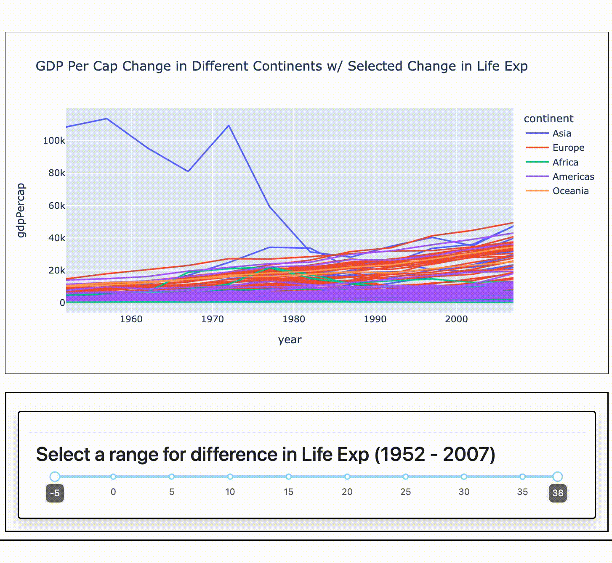

# Component Gallery

Here is a gallery of the individual components you can use with Quickboard, along with some sample code to get 
started trying them out. You can read through this page to get a sense for what is possible with the basic components in
Quickboard. To see the creation of a larger scale app, try reading the [Guided Example](beginner_example.md).

All of the examples below are in the context of the following import:

```
import pandas as pd
import plotly.express as px

import quickboard.base as qbb
import quickboard.plugins as plg
from quickboard.app import start_app
```

In addition, we will be using the `gapminder` dataset provided by Plotly. We can import it into a DataFrame using the
following command:
```
from plotly.data import gapminder

df = gapminder()
```

This is a dataset with information about population, life expectancy, and GDP for different countries over multiple 
years.

All code is run in a Jupyter notebook. When the final `start_app` command is called, it should print a link to
`localhost:8050` where the output can be viewed. Note that the aspect ratio of the image may differ than what is 
shown here based on the dimensions of the window used to view the output. Also note that the `mode` input to `start_app`
can be changed to `inline` to view in the notebook directly, or omitted if running from a `.py` script file.

Tip: If you forget the inputs and usage of a particular class, use the `help` command to see the docstrings, e.g.
`help(qbb.PlotPanel)`. 

# Table of Contents

1. [DynamicPanels](#dynamicpanels)
   1. [PlotPanel](#plotpanel)
   2. [DataPanel](#datapanel)
2. [Plugins](#plugins)
   1. [DataFilterRadioButtons](#datafilterradiobuttons)
   2. [DataFilterChecklist](#datafilterchecklist)
   3. [DataFilterSlider](#datafilterslider)
   4. [DataFilterRangeSlider](#datafilterrangeslider)
   5. [PlotInputRadioButtons](#plotinputradiobuttons)
3. [Interactive Plot Data](#interactive-plot-data)
   1. [Hover/Click Data Plot](#hover--click-data-plot)
   2. [Selected Data Plot](#selected-data-plot)
   3. [Selected Data Table](#selected-data-table)

## DynamicPanels

`DynamicPanel`s are key classes defined in Quickboard which comprise the primary modular components used for visualizing
and interacting with data. Their two incarnations, listed below, both support using plugins to help filter and 
manipulate data displayed in them based on user input.

### PlotPanel

#### Demo


#### Code

```
my_plot = qbb.PlotPanel(
    header="A Plot Panel Example",
    body="Here is an example of using the PlotPanel class.",
    plotter=px.line,
    plot_inputs={
        'x': 'year',
        'y': 'pop',
        'title': "Population Growth over Time in Oceania",
        'line_group': 'country',
        'color': 'country'
    },
    data_source=df[df['continent'] == 'Oceania']
)

start_app(my_plot, mode="external", port=8050)
```

#### Explanation

The `PlotPanel` is one of the essential data types in Quickboard. It includes a `header`, an optional `body` text, and
a Plotly figure object generated from the `plotter` function using the `plot_inputs` and `data_source`. In this example,
we filter the data first to only include countries in Oceania. The plot is automatically interactive as it is a Plotly
figure. Compare the output above with the output of
```
px.line(df[df['continent'] == 'Oceania'], x='year', y='pop', title="Population Growth over Time in Oceania",
        line_group='country', color='country')
```

#### Tips & Tricks

* The `plotter` function can be anything that returns a Plotly figure object, which allows for more refined
preprocessing of the data, or postprocessing of the figure created before displaying.

---

### DataPanel

#### Demo


#### Code

```
my_table = qbb.DataPanel(
    header="A Data Panel Example",
    body="Here is an example of using the DataPanel class.",
    data_source=df
)

start_app(my_table, mode="external", port=8050)
```

#### Explanation

The `DataPanel` is similar to the `PlotPanel` but displays data in tabular form rather than with a plot. Dash allows for
querying the table as demonstrated with some commands above, followed by a Return keystroke. 

#### Tips & Tricks

* The short code block above can turn any DataFrame into an interactive table to query. This is a great way to get to
know new datasets with little effort.
* `DataPanel`s, being a type of `DynamicPanel`, allow for the use of plugins to help query the table in other ways. They
work the same as demonstrated below on `PlotPanel`s.

---

## Plugins

Plugins are objects which can be attached to `DynamicPanel`s or a sidebar when using a tabs/quickboard object to house a
larger app. When placed below a `DynamicPanel`, it allows the user to interact with the data of that panel in a
particular way. When placed in a sidebar, that manipulation extends to all panels in the current tab. In this section,
we focus only on the former case. For more on sidebars and tabs, see the [Guided Example](beginner_example.md). 

### DataFilterRadioButtons

#### Demo


#### Code

```
my_plot = qbb.PlotPanel(
    plotter=px.scatter,
    plot_inputs={
        'x': 'year',
        'y': 'lifeExp',
        'title': "Life Expectancy over the Years for Selected Country"
    },
    data_source=df,
    plugins=[
        plg.DataFilterRadioButtons(
            header="Select a country",
            data_col="country",
            data_values=["United States", "Canada", "Mexico"]
        )
    ]
)

start_app(my_plot, mode="external", port=8050)
```

#### Explanation

We make a scatter plot of `lifeExp` by `year` for one of the three countries selected using radio buttons. When a
button is clicked, the `data_source` gets filtered so that the `data_col` has value equal to the selected option. Then
it gets fed into the first argument of the `plotter` function, along with the `plot_inputs` as the remaining keyword
arguments. Note this filtering is "temporary" in the sense that the original `df` is left untouched, and ready to be
filtered anew when a different button is pressed.

#### Tips & Tricks

* If your `df` doesn't have too many unique values for the `data_col`, you could quickly generate the list for
`data_values` to include all possibilities, with `data_values=df['my_col'].unique()`. Add a `sorted()` to make it
alphabetical as well.
* Consider using fixed axes in the `plot_inputs` to make sure you can safely compare the values on the `y`-axis between
different choices, like so:

Simply add `'range_y': [50, 85]` to the `plot_inputs` dict.

---

### DataFilterChecklist

#### Demo


#### Code

```
countries = ['United States', 'Brazil', 'France', 'Thailand', 'Japan', 
            'Egypt', 'Argentina', 'Indonesia', 'Greece', 'Iran']

my_plot = qbb.PlotPanel(
    plotter=px.scatter,
    plot_inputs={
        'x': 'pop',
        'y': 'lifeExp',
        'color': 'continent',
        'hover_name': 'country',
        'title': "Life Expectancy by Pop for Selected Countries"
    },
    data_source=df[df['year'] == 2007],
    plugins=[
        plg.DataFilterChecklist(
            header="Select countries to include",
            data_col="country",
            data_values=countries
        )
    ]
)

start_app(my_plot, mode="external", port=8050)
```

#### Explanation

We make a scatter plot for `lifeExp` vs the `pop` size for a set of countries in the year 2007. Note we filtered for
the year in the `data_source` input so ensure we only consider values for 2007. After that, the `DataFilterChecklist`
ensures we filter our input data so that the `country` column has value in the `data_values` list to start, i.e. it's
unnecessary to filter the `country` value a priori. Afterwards, when the checklist is updated, it filters the values 
again so that the `country` value is among those selected. Note this doesn't change the input DataFrame, so rechecking a
box will restore previously filtered values.

#### Tips & Tricks

* If you use a `color` input as the above example, removing all data from a color category will automatically recolor
the outputs. This makes it difficult to track where certain data points are, so consider manually coloring the
possible categories using a `category_orders` dict in `plot_inputs`.

---

### DataFilterSlider

#### Demo


#### Code

```
slider_marks = { min(df.year) + 5*i: str(min(df.year) + 5*i) for i in range(0, int((max(df.year) - min(df.year)/5))+1) }

my_plot = qbb.PlotPanel(
    plotter=px.bar,
    plot_inputs={
        'x': 'continent',
        'y': 'pop',
        'color': 'continent',
        'hover_name': 'country',
        'title': "Population in Different Continents for Selected Year",
        'range_y': [0, 4e9]
    },
    data_source=df,
    plugins=[
        plg.DataFilterSlider(
            header="Select a year",
            data_col="year",
            slider_min=min(df.year),
            slider_max=max(df.year),
            slider_default_value=min(df.year),
            slider_step=5,
            slider_marks=slider_marks,
            updatemode='drag'
        )
    ]
)

start_app(my_plot, mode="external", port=8050)
```

#### Explanation

This is a bar chart showing the population in different continents over time, with the year controlled by the slider. We
programmatically generate the min and max values for the slider to allow. The labeled marks are also generated using our
knowledge that the years jump in multiples of 5, going from 1952 to 2007. The `slider_marks` input always takes a dict 
with keys the numerical points on the slider line, and values the string labels that should be placed there. The 
`updatemode` defaults to `mouseup` so we change it to `drag` so that the data updates while the marker is being dragged
rather than waiting for the mouse release. As the slider takes each value, the data is filtered to the rows where the 
`data_col` equals the selected value.

#### Tips & Tricks

* Use Python primitive types for the inputs to the slider, e.g. `int` and `float` instead of `numpy` versions. For
example, `min(df.year)` works to get the minimum year as an integer, but `df.year.min()` returns a `numpy.int64` which
hasn't behaved as well in testing.
* You can let Dash automatically assign labels to the slider given just the min, max, and step size by leaving the
`slider_marks` input empty. When done this way with years, they get rounded to the nearest thousand and display as `2k` 
each, which is not as useful.

---

### DataFilterRangeSlider

#### Demo



#### Code

```
diff = df[df['year'] == 2007]['lifeExp'].reset_index(drop=True) - df[df['year'] == 1952]['lifeExp'].reset_index(drop=True)
diff = pd.DataFrame(diff).rename(columns={'lifeExp': 'lifeExp_diff'})
countries = df[df['year'] == 2007]['country'].reset_index(drop=True)
new_df = pd.concat([countries, diff], axis=1).round(1)
lifeExp_dict = dict(zip(new_df['country'], new_df['lifeExp_diff']))

my_df = df.copy()
my_df['lifeExp_diff'] = df['country'].map(lifeExp_dict)

my_plot = qbb.PlotPanel(
    plotter=px.line,
    plot_inputs={
        'x': 'year',
        'y': 'gdpPercap',
        'color': 'continent',
        'hover_name': 'country',
        'line_group': 'country',
        'title': "GDP Per Cap Change in Different Continents w/ Selected Change in Life Exp",
    },
    data_source=my_df,
    plugins=[
        plg.DataFilterRangeSlider(
            header="Select a range for difference in Life Exp (1952 - 2007)",
            data_col="lifeExp_diff",
            slider_min=min(my_df['lifeExp_diff']),
            slider_max=max(my_df['lifeExp_diff']),
            slider_default_values=[min(my_df['lifeExp_diff']), max(my_df['lifeExp_diff'])],
            slider_step=5,
            tooltip={'always_visible': True, 'placement': 'bottom'}
        )
    ]
)

start_app(my_plot, mode="external", port=8050)
```

#### Explanation

This is a line plot of how `gdpPercap` has changed over the years in different countries. It includes a range slider to 
filter for how much `lifeExp` has changed in that country from 1952 to 2007. For example, if you want to track the GDP
growth only in countries where life expectancy has not changed in that time change, then you can move the slider to only
include `<= 0` values for the `lifeExp_diff` column generated in preprocessing. Simimarly you can track the change in
countries which had the largest change in `lifeExp`, or within any range you set with the slider. In this example, the 
`tooltip` input having `always_visible` turned on means the current value will always hover over the edge, with a 
`bottom` value for `placement`. The default is this is only visible on hover.

#### Tips & Tricks

* You can use the `edges_infinite=True` input to the range slider to treat the edges of the range as "infinite", meaning
there is no restriction imposed on the data when the slider is pulled to the edge. This is useful when you don't want to
cap the data displayed, but don't want the scale being stretched by outliers. For example, suppose you want to allow
filtering from `0 - 10+` for some value. You can preprocess the dataset to ensure the value is always `>= 0`, then use
the `edges_infinite=True` input with slider min and max 0 and 10 respectively. That way, when 10 is selected, there will
be no filtering done on the right. You can use the `slider_marks` dict to even label the value at 10 accordingly:
`{10: "10+", ...}`. 

---

### PlotInputRadioButtons

#### Demo


#### Code

```
def update_plot_and_title(df, **inputs):
    fig = px.scatter(df, **inputs)
    fig.update_layout(title=f"{inputs['y']} by Year for United States")
    fig.update_layout(title_x=0.5)
    return fig

my_plot = qbb.PlotPanel(
    header="Plotting Various Stats by Year for United States",
    body="Choose from the buttons below a value to plot for y on the axis. \
    The plot will update to show its change over time for the United States.",
    plotter=update_plot_and_title,
    plot_inputs={
        'x': 'year',
        'y': 'pop',
    },
    data_source=df[df['country'] == 'United States'],
    plugins=[
        plg.PlotInputRadioButtons(
            header="Select a value to plot for y",
            plot_input='y',
            data_values=['pop', 'lifeExp', 'gdpPercap']
        )
    ]
)

start_app(my_plot, mode="external", port=8050)
```

#### Explanation

In this example we write our own custom `plotter` function, which always takes in the `data_source` and the
`plot_inputs` dict and returns a Plotly figure. Because this plugin changes the value of `y`, we use this to also update
the title based on the selected value. Note we filter the data beforehand to just look at data for the United States. We
also put in some header/body text to give a bit more description to the plot.

#### Tips & Tricks

* In general, using custom `plotter`s gives you full access to using Plotly's figure customization, instead of just
using the ones defined in Plotly Express. 
* You can use this plugin to have very different behavior based on the selected button. Because the `plot_input` dict
is sent as an input to the `plotter`, you can write a `plotter` which even changes the type of graph made based on the
button chosen using conditionals. 

---

## Interactive Plot Data

This section demonstrates some functionality in using Dash's features for allowing selected data in a plot to be used as
input into another plot or table. The input source must be a Plotly scatter plot, and there are a few requirements to
ensure proper behavior. They are:
* The `data_source` for the input must have a column named `index` which is a copy of the DataFrame index.
* The `plot_inputs` for the scatter plot must have a `custom_data=['index']` value.
* The `data_source` for the responding plot/table must be a list with first entry the input `PlotPanel` and second entry
one of the following modes: `'hoverData'`, `'clickData'`, or `'selectedData'`. The different behaviors are demonstrated
below. 

With this setup, whenever the data from the first panel is selected, the second panel will call its update function
using the sub-DataFrame whose indices match the indices of the selected data points. 

### Hover / Click Data Plot

#### Demo


#### Code

```
df['index'] = df.index

first_plot = qbb.PlotPanel(
    header="Primary Plot",
    plotter=px.scatter,
    plot_inputs={
        'x': 'gdpPercap',
        'y': 'lifeExp',
        'custom_data': ['index'],
        'title': "Life Exp vs GDP per Cap in 2007",
        'color': 'continent',
        'log_x': True,
        'hover_name': 'country'
    },
    data_source=df[df['year'] == 2007]
)

def make_line_plot(selected_df, **inputs):
    chosen_countries = selected_df['country'].values
    plot_df = df[df['country'].isin(chosen_countries)]  # df means gapminder
    if len(chosen_countries) > 0:
        inputs['title'] = f"Population Growth for {chosen_countries[0]}"
    return px.line(plot_df, **inputs)

second_plot = qbb.PlotPanel(
    header="Secondary Plot",
    plotter=make_line_plot,
    plot_inputs={
        'x': 'year',
        'y': 'pop',
        'title': "Population Growth for Selected Countries",
        'color': 'continent',
        'line_group': 'country'
    },
    data_source=[first_plot, "hoverData"]
)

content = qbb.ContentGrid(
    entities=[
        first_plot,
        second_plot
    ]
)

start_app(content, mode="external", port=8050)
```

#### Explanation

Here we have two plots inside of a `ContentGrid` which keeps the plots in a grid layout that can be input to the 
`start_app` function. The first is a typical scatter plot like the ones above, but the second plot has its data source
linked to the first plot in the `hoverData` mode. When a point in the first plot is hovered over, the `plotter` for the
second plot is called. In this case, `make_line_plot` was created to first get the list of countries (just one here)
selected, filter the original gapminder `df` to consider only that country, and then update the title. The output is the
line plot of population vs year for the selected country. 

The same behavior, but with a mouse click instead of hover triggering the update, can be achieved by using `clickData`
mode instead of `hoverData`.

#### Tips & Tricks

* Despite only getting back the subset of the first plot's `data_source` whose indices match the selected data, we can
use that information to go back to the original `df` to create the relevant DataFrame for the second plot to use. This
was import in this example since the first plot originally filtered the data to only look at year 2007. 

---

### Selected Data Plot

#### Demo


#### Code

```
df['index'] = df.index

first_plot = qbb.PlotPanel(
    header="Primary Plot",
    plotter=px.scatter,
    plot_inputs={
        'x': 'gdpPercap',
        'y': 'lifeExp',
        'custom_data': ['index'],
        'title': "Life Exp vs GDP per Cap in 2007",
        'color': 'continent',
        'log_x': True,
        'hover_name': 'country'
    },
    data_source=df[df['year'] == 2007]
)

def make_line_plot(selected_df, **inputs):
    chosen_countries = selected_df['country'].values
    plot_df = df[df['country'].isin(chosen_countries)]  # df means gapminder
    return px.line(plot_df, **inputs)

second_plot = qbb.PlotPanel(
    header="Secondary Plot",
    plotter=make_line_plot,
    plot_inputs={
        'x': 'year',
        'y': 'pop',
        'title': "Population Growth for Selected Countries",
        'color': 'continent',
        'line_group': 'country'
    },
    data_source=[first_plot, "selectedData"]
)

content = qbb.ContentGrid(
    entities=[
        first_plot,
        second_plot
    ]
)

start_app(content, mode="external", port=8050)
```

#### Explanation

This example has the second plot's data generated using the indices of the data points in the first chosen using the box
select and lasso select tools. The code is almost identical to the last example, except the updating title code was
removed (due to a general selection returning many country names). This functionality is achieved by using the 
`selectedData` mode.

#### Tips & Tricks

* Be careful about referencing the globally defined `df` inside of methods like `make_line_plot`, since if your code
modifies `df` anywhere, this could cause some unexpected behavior. Quickboard code should never modify original
DataFrames so you should be able to safely reference them again elsewhere.

---

### Selected Data Table

#### Demo


#### Code

```
df['index'] = df.index

first_plot = qbb.PlotPanel(
    header="Primary Plot",
    plotter=px.scatter,
    plot_inputs={
        'x': 'gdpPercap',
        'y': 'lifeExp',
        'custom_data': ['index'],
        'title': "Life Exp vs GDP per Cap in 2007",
        'color': 'continent',
        'log_x': True,
        'hover_name': 'country'
    },
    data_source=df[df['year'] == 2007]
)

second_table = qbb.DataPanel(
    header="Secondary Table",
    body="Table of Values from Selected Data",
    data_source=[first_plot, "selectedData"]
)

content = qbb.ContentGrid(
    entities=[
        first_plot,
        second_table
    ]
)

start_app(content, mode="external", port=8050)
```

#### Explanation

This example uses the interactive plot data sources to generate a table from the data selected in the first plot using
the box select or lasso tools. The plot is the same as the last two examples, but now we feed the selected data directly
into a table. This can be thought of as another way to query a data table, through visuals.

#### Tips & Tricks

* You can also use plugins in the `DynamicPanel`s whose data sources are provided by scatter plots, if you want to be
sure the displayed data is filtered or manipulated according to some interactions.
